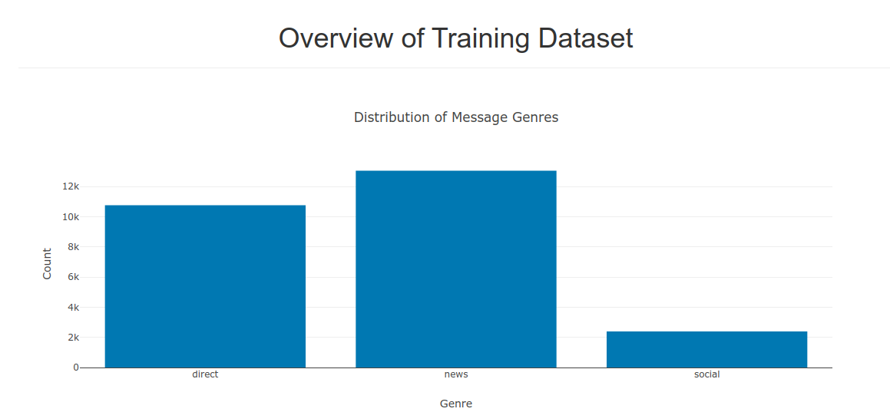
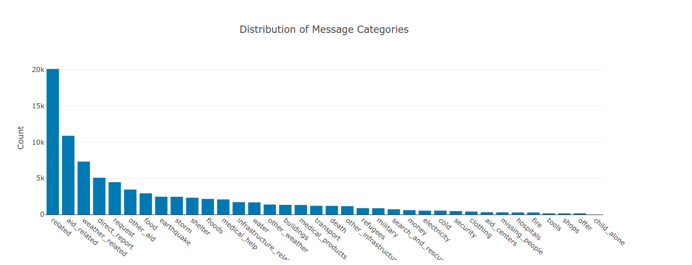
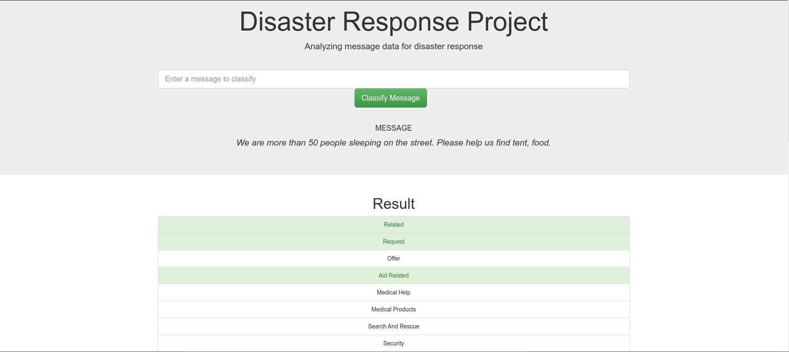

# DISASTER_WEB_APP

***
 
# PROJECT MOTIVATION

In the project, I apply data engineering skills to analyze disaster data from [Figure Eight](https://www.figure-eight.com/) and build an NLP model that can be accessed by a Flask API. The user can submit their messages to the API via an interface and be classified into 36 disaster categories.

## LIBRARIES

    * pandas
    * Flask
    * nltk
    * joblib
    * plotly
    * SQLAlchemy
    * pandas
    * nltk
    * scikit_learn

* install python 3.8
* Install required packages with:
    * pip install -r requirements.txt

**Step 1** - run process_data.py at the root of data folder

cmd - python process_data.py disaster_messages.csv disaster_categories.csv DisasterResponse.db

**Step 2** - train_classifier.py - run at the root of models folder.

cmd - python train_classifier.py ./data/DisasterResponse.db

**Step 3** - run.py - run at root of app folder.

cmd - python app.py

# PROJECT COMPONENTS

1. **ETL Pipeline** - In a Python script, process_data.py steps will be applied to extract, transform, and load data to the SQLite database.

    * Loads the messages and categories datasets
    * Merges the two datasets
    * Cleans the data
    * Stores it in a SQLite database

2. **ML Pipeline** - In the Python script, train_classifier.py creates an ML pipeline for multiclass classification.

    * Loads data from the SQLite database
    * Splits the dataset into training and test sets
    * Builds a text processing and machine learning pipeline
    * Trains and tunes a model using GridSearchCV
    * Outputs results on the test set
    * Exports the final model as a pickle file

3. **Flask Web App** - In the Python script, run.py, the web app can use the ML model to classify disaster response messages to 36 classes.

    * Loads Model
    * Creates Visualizations
    * Cleans input
    * Classify messages


# FOLDER STRUCTURE
```
- app
| - template
| |- master.html - main page of web app
| |- go.html  - classification result page of web app
|- run.py  - Flask file that runs app

- data
|- disaster_categories.csv - data to process 
|- disaster_messages.csv - data to process
|- process_data.py - script to process data
|- InsertDatabaseName.db - database to save clean data

- models
|- train_classifier.py - script to process ML steps
|- classifier.pkl - saved model 

- imgs
|- .png - web app images

- requirements.txt - packages used in project
- README.md - project description
```

# WEB APP SCREENSHOTS



